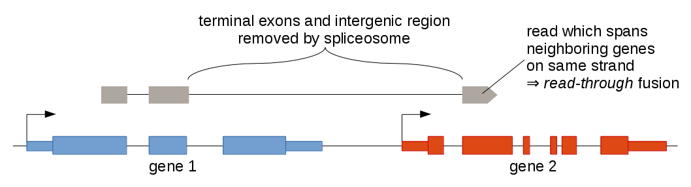
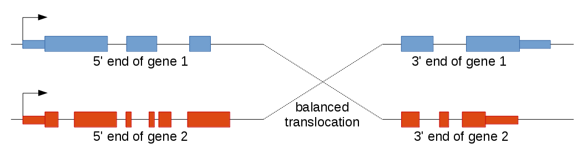

Confidence scoring
------------------

To each prediction Arriba assigns a confidence of low, medium, or high. The confidence should reflect three aspects, namely the likelihood that

- the transcript is aberrant (not seen in healthy tissue).

- it can be explained by an underlying genomic rearrangement.

- it is not an artifact.

The validation rate alone does not determine the confidence. For example, transcripts which would surely validate via Sanger sequencing, still receive a low confidence (or are filtered altogether), if they are also seen in healthy tissue. This is particularly true for potential read-through fusions or circular RNAs. The confidence is also not influenced by the oncogenic potential of a fusion. Events with little or no tumorbiological relevance can be assigned the same confidence as well-known driving fusions. For example, shattered genomes often generate a large amount of fusions, most of which are passenger aberrations and only few are actually relevant to the tumor biology. The passenger events will still be given a high confidence, because they fulfill all of the above criteria.

The predictions are listed from highest to lowest in the output file. The ranking is most influenced by the number of supporting reads. But many additional features are taken into account as well, such as the proximity of the breakpoints (intragenic vs. read-through vs. distal), multiple transcript variants between the same pair of genes, or the level of background noise in a given gene ([e-value](internal-algorithm.md)).

The confidence scoring can be used as a coarse guide for inexperienced users. According to internal tests, about two thirds of the high-confidence predictions correlate with a genomic rearrangement, one third of the medium-confidence predictions, and 5-10% of the low-confidence predictions. This can be considered a lower bound for the validation rate, since some aberrant transcripts arise via other mechanisms than genomic rearrangements and because some events are easily missed in DNA-Seq data (e.g., breakpoints in long tandem repeats).

Medium confidence predictions usually have a high number of supporting reads, but one or more characteristics of the predictions are frequently observed with artifacts. Among other factors, events which lack split reads, might be read-through fusions, or have a high level of background noise are classified as medium-confidence.

In view of the low confirmation rate of low-confidence predictions, these predictions should be treated with skepticism. Unless there is additional evidence corroborating the prediction, it is advisable to ignore the prediction. Examples for corroborating evidence are:

- well-known event for the given entity

- confirmation via structural variant calls obtained from a DNA-Seq sample from the same tumor

- confirmation from a RNA-Seq sample of a metastasis originating from the same tumor (i.e., the event is found in two independent RNA-Seq samples from the same tumor or related lesions)

Low-confidence fusions can prove useful in situations where sensitivity is crucial, such as in a clinical setting or when a sample has low purity or low library complexity.

Activating fusions
------------------

Gene fusions that lead to activation of oncogenes are typically among the high-confidence predictions and have ample supporting reads, since they are highly expressed. Often (but not always), one can see a sharp increase in expression of the exons retained in the fusion transcript compared to the other exons. The transcribed strands should match the coding strands of the affected genes. The columns `strand1(gene/fusion)` and `strand2(gene/fusion)` report the strands of the genes (before the slash) and the strands being transcribed (after the slash), which should be identical, if the fusion is assumed to result in a gain of function. As the oncogene usually constitutes the 3' end of the fusion transcript, the reading frame should be preserved across the fusion junction. Even when the oncogene is fused at the 5' end, the reading frame is usually intact, because the 3' fusion partner provides protein domains which enhance oncogenic function (e.g., dimerization or membrane-embedding). Provided that Arriba was run with the parameter `-P`, the column `reading_frame` in Arriba's output file specifies whether the fusion is in-frame or out-of-frame. Alternatively, the breakpoints of the fusion can be [inspected using IGV](visualization.md#inspection-of-events-using-igv) to interrogate the reading frames of the exons adjacent to the breakpoints. In most cases, the breakpoints of activating fusions coincide with splice-sites. Sometimes they are located within coding exons. Only very rarely are they found in introns or UTRs, because these regions do not code for proteins. For example, EML4-ALK fusions are known to have a breakpoint in an intron of ALK (close to exon 20), because transcribing a few intronic bases rescues the reading frame between EML4 and ALK. It is advisable to check if protein domains that are essential for oncogenic function are retained in the fusion. Fusions with receptor tyrosine kinases are expected to retain the kinase domain, for instance. Which protein domains are retained or lost can be examined [by loading the protein domain track shipped with Arriba into IGV](visualization.md#inspection-of-events-using-igv) (see the `database` directory inside the [release tarballs](https://github.com/suhrig/arriba/releases) of Arriba). Alternatively, the script `draw_fusions.R` can be used to [render visualizations](visualization.md#publication-quality-figures) of Arriba's fusion predictions, which depict the retained protein domains graphically.

Notable exceptions to the above rules are rearrangements involving the [T-cell receptor loci](https://doi.org/10.1038/ng.3909) or the [immunoglobulin loci](https://doi.org/10.1182/blood-2007-02-069625) as frequently found in some hematologic malignancies. Such rearrangements mediate oncogene activation by means of enhancer hijacking. Therefore, the breakpoints can be in intergenic regions near the oncogene rather than at a splice-site or inside a coding exon.

Inactivating fusions
--------------------

Loss-of-function fusions typically affect tumor suppressor genes, such as NF1/2, PTEN, TP53, or RB1. In contrast to activating fusions the affected genes need not necessarily be fused in a way which preserves the reading frame, since any rearrangement which disrupts proper expression or translation inactivates a gene. As such, the breakpoints can be anywhere inside the gene, though they are often found at a splice-site in one of the genes. Moreover, fusions with the antisense strand (see `strand1/2` columns) and with intergenic regions are common observations. Inactivating fusions are often expressed at low levels, since the very purpose of the rearrangement is to silence a gene. These fusion predictions are found among the low-confidence predictions.

Supporting read count
---------------------

The number of supporting reads is one of the most helpful attributes to distinguish artifacts from true events. True predictions typically have a high number of supporting reads. What should be considered high depends on the expression of the gene, but having >10 supporting reads is sufficient in most situations. Only few types of artifacts produce predictions with more supporting reads than this (most notably in vitro artifacts). It is very common for fusions to be supported by only a fraction of the expression of a gene. Firstly, chimeric alignments are difficult to find and STAR fails to report particularly those with short clipped segments. A prominent example are translocations with immunoglobulin loci or T-cell receptors, both of which are difficult to map with short reads. Secondly, certain translocations generate few supporting reads despite the gene being highly expressed, for example, when one allele of a tumor suppressor is inactivated via a fusion, which is expressed at a low level, and the other allele is highly expressed, but also defective due to a mutation. Therefore, even predictions with just 2-5 reads can be correct. Arriba requires the supporting read count to correlate with expression. But the number of supporting reads can be quite low and the predictions may seem questionable, even though they are correct oftentimes. For example, the process of gene amplification is often sloppy, in the sense that some copies of the amplified gene are incomplete and translocated to genes in close proximity, leading to fusions with many genes in the vicinity. Most of these are low-expressed and have only few supporting reads, hence, but they are nonetheless true predictions. Skepticism is advised when a fusion has only few supporting reads, but one of the fused genes is among the top expressed genes. Especially driving fusions should have a lot of supporting reads (dozens or even hundreds), because these fusions are highly transcribed.

True predictions usually have a balanced number of split reads and discordant mates. Events with only discordant mates or without discordant mates and only split reads having anchors in just one gene are frequently artifacts. At least two out of the three columns `split_reads1`, `split_reads2`, and `discordant_mates` should be non-zero and in a similar range. True predictions may have one of the columns set to zero, for example, when one of the breakpoints is difficult to map or when the overall number of supporting reads is low. But having five or more supporting reads all of which are assigned to the same column is dubious. In addition, the supporting reads of true predictions usually make up at least 1% of the coverage at the breakpoints. The coverage can be taken from the columns `coverage1/2`.

Frequent types of false positives
---------------------------------

Many of the false positives fall into one of the following categories. For many categories there is a filter that should prevent the incorrect prediction, but the filters are not perfectly accurate and making them more stringent would hurt sensitivity.

**Read-through fusions**

Even in healthy tissue it happens very frequently that transcripts are produced which are composed of exons from two neighboring genes on the same strand. These transcripts often contain all but the last exon of the 5' gene and all but the first exon of the 3' gene. They are caused by RNA polymerases missing the stop sign at the end of the 5' gene and "reading through" until reaching the next stop sign at the end of the 3' gene. The splicesome then removes the intergenic region between the two genes, yielding a chimeric transcript.



For some genes, this is a common phenomenon, which is not reflected in the gene annotation, however, and therefore appears like an aberrant transcript at first glance. The [SLC45A3:ELK4 fusion](https://doi.org/10.1158/0008-5472.CAN-08-4926), which has been discovered in prostate cancer and has also been described in benign prostate tissue, is one such example. It is risky to discard all read-through events, however, because they might be the result of a focal deletion, which fuses two neighboring genes together. For example, the [GOPC:ROS1 fusion](https://doi.org/10.1002/gcc.10207) in glioblastoma multiforme is caused by a 240 kb deletion. Arriba uses [a comprehensive blacklist](input-files.md#blacklist) trained on collections of RNA-Seq samples from healthy tissue to remove likely harmless transcript variants. Rare transcript variants still bypass this filter often enough. Read-through events are therefore tagged as `deletion/read-through` to make the user aware of a potential false positive. Further evidence should be sought to substantiate the prediction, such as:

- high expression of the transcript

- a deletion detected in DNA-Seq data as a structural variant or copy-number alteration

- multiple deletion/read-through events affecting the same region (it is unlikely that many events pass the blacklist)

**Circular RNAs**

[Circular RNAs](https://doi.org/10.1177/1535370217708978) are transcripts which are spliced in a non-canonical mannor such that the 5' and 3' ends are ligated together, yielding a closed ring. In RNA-Seq data they manifest as intragenic duplications with both breakpoints at splice-sites. It is very hard to distinguish genomic duplications from circular RNAs without whole-genome sequencing data. Similar to read-through fusions, these transcripts are abundant in healthy tissue and affect many genes. Arriba's blacklist effectively filters the majority of such events, but occasionally some pass the filter. For this reason, they are tagged as `duplication/non-canonical_splicing` to warn the user about a potential false positive.

**In vitro artifacts**

In some tissues certain genes are expressed at very high levels, for example hemoglobin and fibrinogen in blood or collagens in connective tissue. Presumably, the abundance of RNA molecules from these genes increases the chance of unrelated molecules sticking together via hybridization. These hybdrized molecules mediate template switching by reverse transcriptase, generating a large amount of chimeric fragments in vitro. The filter `in_vitro` should remove such events, but sometimes it fails, because making it more restrictive would increase the risk of missing fusions involving highly expressed genes. In vitro-generated fusions have the following characteristics:

- Most of the time, these events have very few split-reads (1-2) while having a high number of discordant mates (dozens).

- Often, multiple genes form a network of in vitro fusions. The output file then contains many events between a small set of genes. These genes are typically expressed at a high level (in the top percentile).

- The breakpoints are mostly in exons, rather than at exon boundaries or in introns. Since these artifacts are generated during library preparation, introns have already been removed. The molecules break at random locations and the breakpoints are unlikely to coincide with splice-sites.

Example:

```
gene1  gene2  strand1 strand2 breakpoint1 breakpoint2 site1 site2 type          direction1 direction2 split_reads1 split_reads2 discordant_mates confidence
S100A6 EEF1A1 -/-     -/-     1:153507149 6:74229778  3'UTR 5'UTR translocation upstream   downstream 0            1            11               high
EEF1A1 EEF2   -/-     -/-     6:74227963  19:3980028  exon  exon  translocation upstream   downstream 2            0            10               high
AHNAK  HLA-B  -/-     -/-     11:62286163 6:31322973  exon  exon  translocation upstream   downstream 1            0            10               high
B2M    HLA-B  +/+     -/-     15:45010186 6:31324076  3'UTR exon  translocation downstream downstream 0            0            10               medium
KRT6A  LDHA   -/-     +/+     12:52881705 11:18418365 exon  5'UTR translocation upstream   upstream   0            0            10               medium
FLNA   KRT6A  -/-     -/-     X:153578196 12:52886822 5'UTR exon  translocation upstream   downstream 0            0            10               medium
GAPDH  MUC5B  +/+     +/+     12:6647133  11:1264669  exon  exon  translocation downstream upstream   0            0            10               medium
MUC5B  GAPDH  +/+     +/+     11:1282959  12:6646126  3'UTR exon  translocation downstream upstream   0            0            9                low
GAPDH  ALDOA  +/+     +/+     12:6647376  16:30077176 3'UTR 5'UTR translocation downstream upstream   0            0            10               medium
S100A6 GAPDH  -/-     +/+     1:153507153 12:6645674  3'UTR UTR   translocation upstream   upstream   0            0            10               medium
```

**Internal tandem duplications**

Internal tandem duplications (ITDs) are recurrent drivers in some malignancies, affecting genes such as FLT3, ERBB2, EGFR, and BCOR. However, ITDs also occur frequently as (likely benign) germline polymorphisms. Since RNA-Seq data from a germline control sample are usually not available, Arriba cannot reliably distinguish between somatic and germline ITDs. Arriba can only remove germline ITDs that are frequent in the population and thus part of its blacklist. Rare germline ITDs may therefore show up as false positives in Arriba's output. ITDs are flagged with the additional keyword `ITD` in the `type` column in the output file of Arriba.

**Fusions recovered by the known fusions list**

When Arriba is run with a list of known fusions (parameter `-k`), it is particularly sensitive towards evidence concerning these fusion partners. Even when there are only few supporting reads, the event is reported. Obviously, this may lead to false positive predictions. These false positives can be recognized as low-confidence predictions with typically only 1 or 2 supporting reads (which is the minimum number of supporting reads to be recovered by the filter `known_fusions`).

Multiple transcript variants
-----------------------------

**Additional isoforms**

Arriba searches for additional transcript variants, once it has detected a fusion between a pair of genes with sufficient confidence. The filter `isoforms` reports all events having both breakpoints at splice-sites. The additional isoforms are reported as events between the same pair of genes, but with different breakpoints and the columns `site1` and `site2` set to `splice-site`. Evidence for multiple transcript variants increases the credibility of a prediction, because it implies that the spliceosome was involved in producing the transcript, which in turn implies that the event was generated in living tissue as opposed to during library preparation. It rarely happens that in vitro artifacts generate events with both breakpoints at splice-sites (since in vitro-generated breakpoints are scattered randomly), and it is even more unlikely to happen twice between the same pair of genes. Therefore, seeing several events with breakpoints at splice-sites increases the confidence. Example:

```
gene1 gene2 strand1 strand2 breakpoint1 breakpoint2 site1       site2       type          direction1 direction2 split_reads1 split_reads2 discordant_mates confidence
BCAS4 BCAS3 +/+     +/+     20:49411711 17:59445688 splice-site splice-site translocation downstream upstream   140          129          300              high
BCAS4 BCAS3 +/+     +/+     20:49411711 17:59430949 splice-site splice-site translocation downstream upstream   10           3            299              high
BCAS4 BCAS3 +/+     +/+     20:49411711 17:59431723 splice-site splice-site translocation downstream upstream   0            1            299              high
```

**Balanced translocations**

Balanced translocations (i.e., swapping of chromosome arms) often lead to a similar situation. Again, multiple transcript variants may be produced, but here some transcripts have one gene as the 5' end and other transcripts the other gene. This is because balanced translocations fuse the 5' end of the first gene to the 3' end of the second gene and vice versa.



Example:

```
gene1 gene2 strand1 strand2 breakpoint1  breakpoint2  site1       site2       type          direction1 direction2 split_reads1 split_reads2 discordant_mates confidence
FLI1  EWSR1 +/+     +/+     11:128675327 22:29688126  splice-site splice-site translocation downstream upstream   0            4            0                high
EWSR1 FLI1  +/+     +/+     22:29684776  11:128679052 splice-site splice-site translocation downstream upstream   1            0            2                high
```

**Multiple read-through events**

As explained in section [Frequent types of false positives](#frequent-types-of-false-positives), read-through fusions are hard to distinguish from transcripts arising from small deletions. The latter can sometimes be recognized as such by producing multiple predictions in the output file of Arriba. In the following example, a focal deletion of the cell cycle-regulating gene CDKN2A gives rise to multiple events of type `deletion/read-through` involving the neighboring genes MTAP, CDKN2B-AS1, UBA52P6, and RP11-408N14.1. Detection of several events of the same type in the same region reduces the likelihood that the event was generated by read-through, because this would imply that none of the events were part of the blacklist. It may be conceivable that one transcript variant passes the blacklist, but two or more is increasingly improbable. Example:

```
gene1 gene2         strand1 strand2 breakpoint1  breakpoint2  site1       site2       type                        direction1 direction2 split_reads1 split_reads2 discordant_mates confidence
MTAP  CDKN2B-AS1    +/+     +/+     9:21818202   9:22029432   splice-site splice-site deletion/read-through       downstream upstream   3            3            20               high
MTAP  CDKN2B-AS1    +/+     +/+     9:21818202   9:21995047   splice-site splice-site deletion/read-through       downstream upstream   1            0            22               high
MTAP  CDKN2B-AS1    +/+     +/+     9:21818202   9:22092307   splice-site splice-site deletion/read-through       downstream upstream   1            3            14               high
MTAP  CDKN2B-AS1    +/+     +/+     9:21818202   9:22046750   splice-site splice-site deletion/read-through       downstream upstream   0            1            16               high
MTAP  CDKN2B-AS1    +/+     +/+     9:21818202   9:22097257   splice-site splice-site deletion/read-through       downstream upstream   4            1            10               high
MTAP  CDKN2B-AS1    +/+     +/+     9:21818202   9:22096371   splice-site splice-site deletion/read-through       downstream upstream   2            1            12               high
MTAP  CDKN2B-AS1    +/+     +/+     9:21818202   9:22112319   splice-site splice-site deletion/read-through       downstream upstream   4            3            7                high
MTAP  CDKN2B-AS1    +/+     +/+     9:21818202   9:22120503   splice-site splice-site deletion/read-through       downstream upstream   5            1            4                high
MTAP  CDKN2B-AS1    +/+     +/+     9:21818202   9:22120199   splice-site splice-site deletion/read-through       downstream upstream   1            0            4                high
MTAP  UBA52P6       +/+     +/+     9:21818202   9:22012127   splice-site 5'UTR       deletion/read-through       downstream upstream   1            2            1                high
MTAP  RP11-408N14.1 +/+     -/+     9:21818202   9:22210663   splice-site intron      deletion/read-through/5'-5' downstream upstream   3            4            3                medium
```

Cohort analysis
---------------

In order to find recurrent fusion events within a cohort of samples of the same cancer type, it is recommended to ignore low-confidence predictions during the initial analysis. After a number of recurrent events have been identified from the medium- and high-confidence predictions, one can screen those with low confidence for additional occurrences of the same event. This two-tiered approach reduces the number of recurrent artifacts when ranking events by frequency, since low-confidence predictions have a substantial fraction of false positives.

It makes sense to not only search for recurrently fused gene pairs, but also for recurrently fused individual genes. Oftentimes, the same gene is fused to varying partners in different samples. This is particularly true for tumor supressor genes, which are typically involved in loss-of-function fusions with various genes or intergenic regions.

Once the recurrently fused genes have been identified, one should look at the properties of the events in the output files of Arriba. It is not uncommon for recurrent events to be recurrent artifacts. Inspecting the properties helps explain how the (incorrect) prediction came to be. Common sources of recurrent artifacts are:

- read-through fusions, circular RNAs, and other rare splice-variants which are not captured by the blacklist

- highly expressed genes, which lead to artifacts induced during library preparation

It can be very helpful to run Arriba with structural variant calls obtained from whole-genome sequencing data, if available (see parameter `-d`). Removing events which are not confirmed via DNA-Seq data in any of the affected samples should reduce the false positive rate substantially.

