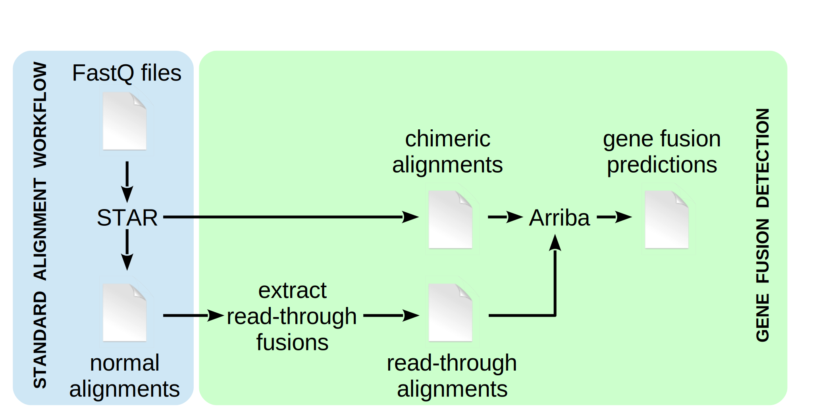

Fusion detection with Arriba is based on the STAR aligner. It is an extension of the regular alignment workflow, which can be incorporated with few modifications. The addition of Arriba does not affect the normal alignments. The workflow yields fusion predictions as well as normal alignments that can be used for other downstream analyses such as expression quantification or variant calling. Like so, fusion detection incurs negligible computational overhead, since it adds only a few minutes of runtime to the regular alignment workflow.

Implementing Arriba is done in three steps:

1. Detection of chimeric reads must be enabled in `STAR` by [adding command-line parameters](execution.md#star). This generates an additional output file containing all [chimeric alignments](input-files.md#chimeric-alignments) (split reads and discordant mates). This file contains evidence about translocations, inversions, duplications, and deletions larger than the usual intron size (as defined by the parameter `--alignIntronMax`).

2. `extract_reads` scans the normal alignments for reads which potentially indicate read-through transcripts or deletions smaller than the usual intron size. It puts the candidate reads into a separate BAM file, the [read-through alignments](input-files.md#chimeric-alignments) file.

3. `arriba` processes the chimeric alignments file and read-through alignments file. It applies a set of [filters](internal-algorithm.md) to remove artifacts and transcripts observed in healthy tissue. The final [output](output-files.md) is a list of high-confidence fusion predictions.

