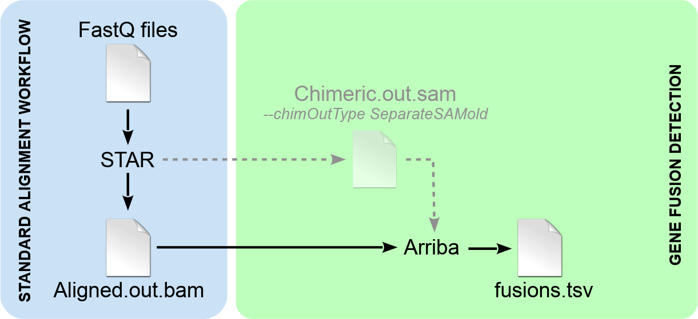

Fusion detection with Arriba is based on the STAR aligner. It is an extension of the regular alignment workflow, which can be incorporated with few modifications. The addition of Arriba does not affect the normal alignments. The workflow yields fusion predictions as well as normal alignments that can be used for other downstream analyses such as expression quantification or variant calling. Like so, fusion detection incurs negligible computational overhead, since it adds only a few minutes of runtime to the regular alignment workflow.



Implementing Arriba is done in two steps:

1. Detection of chimeric reads must be enabled in STAR by specifying the parameter `--chimSegmentMin`. In addition, the parameter `--chimOutType WithinBAM` must be specified to cause STAR to report chimeric reads as supplementary alignments in the main output file `Aligned.out.sam`. Old versions of STAR (or when STAR is run with `--chimOutType SeparateSAMold`) wrote supplementary alignments to a separate file named `Chimeric.out.sam`. Arriba is compatible with this mode of use (see parameter `-c`), but it is deprecated, because STAR might not support it anymore in the future.

2. Arriba extracts the supplementary alignments from the given input file(s). The supplementary alignments represent evidence about translocations, inversions, duplications, and deletions larger than the usual intron size (as defined by the parameter `--alignIntronMax`). In order to find fusions arising from deletions smaller than the maximum intron size, Arriba also extracts alignments which cross the boundaries of annotated genes. Once all alignments have been extracted, it applies a set of [filters](internal-algorithm.md) to remove artifacts and transcripts observed in healthy tissue. The final [output](output-files.md) is a list of fusion predictions which pass all of Arriba's filters.

Demo script
-----------

Arriba comes with a script `run_arriba.sh` that illustrates the usage of all components of the workflow and how they are meant to interact with each other. The script is deliberately kept simple and lacks error checking and input validation. The script is meant only as a guide which demonstrates how to integrate Arriba into your own STAR-based workflow. The following paragraphs explain the steps of the demo script:

In order for STAR to search for chimeric alignments, the parameter `--chimSegmentMin` must be specified and the parameter `--chimOutType` must be set to `WithinBAM` or `SeparateSAMold`. In addition, the following parameters related to chimeric alignment are recommended for improved sensitivity:

```bash
--chimSegmentMin 10 --chimOutType WithinBAM SoftClip --chimJunctionOverhangMin 10 --chimScoreMin 1 --chimScoreDropMax 30 --chimScoreJunctionNonGTAG 0 --chimScoreSeparation 1 --alignSJstitchMismatchNmax 5 -1 5 5 --chimSegmentReadGapMax 3
```

Arriba does not care, if the BAM files are sorted/indexed or not. For maximum speed, STAR's output should be piped directly to Arriba, such that chimeric reads are extracted while STAR is still running. STAR can be instructed to write alignments to `STDOUT` using the parameters `--outStd BAM_Unsorted` and `--outSAMtype BAM Unsorted`. Furthermore, it is recommended to pipe the alignments in uncompressed format to Arriba (`--outBAMcompression 0`), because BAM compression is not parallelized well in STAR and [becomes a bottleneck when using more than six to eight threads](https://github.com/alexdobin/STAR/issues/351).

A complete call of STAR in conjunction with Arriba may look like this:

```bash
STAR \
	--runThreadN 8 \
	--genomeDir /path/to/STAR_index --genomeLoad NoSharedMemory \
	--readFilesIn read1.fastq.gz read2.fastq.gz --readFilesCommand zcat \
	--outStd BAM_Unsorted --outSAMtype BAM Unsorted --outSAMunmapped Within --outBAMcompression 0 \
	--outFilterMultimapNmax 1 --outFilterMismatchNmax 3 \
	--chimSegmentMin 10 --chimOutType WithinBAM SoftClip --chimJunctionOverhangMin 10 --chimScoreMin 1 --chimScoreDropMax 30 --chimScoreJunctionNonGTAG 0 --chimScoreSeparation 1 --alignSJstitchMismatchNmax 5 -1 5 5 --chimSegmentReadGapMax 3 |
arriba \
	-x /dev/stdin \
	-o fusions.tsv -O fusions.discarded.tsv \
	-a /path/to/assembly.fa -g /path/to/annotation.gtf -b /path/to/blacklist.tsv.gz \
	-T -P
```

For a comprehensive list of the parameters, please refer to section [Command-line options](command-line-options.md).

